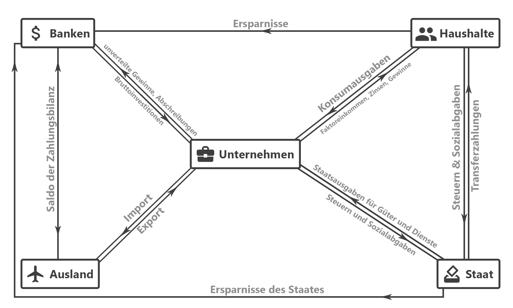

# 🗿 Zusatzzettel

#### Inhalt

- [Grundbegriffe](#begriffe)
- [Wirtschaftskreislauf](#kreislauf)

- [Unternehmensformen](#formen)
- [Inflation](#inflation)

------

# Grundbegriffe 

- **Gewinn** ist der Umsatz minus die Ausgaben.
- **Umsatz** sind alle Einnahmen die z.B. durch Verkäufe oder Handel erzeugt wurden. Anderes Wort: Erlös.

[Ein kleines Lexikon mit allen wichtigen Begriffen](https://www.bpb.de/system/files/dokument_pdf/Pocket_Wirtschaft_bpb.pdf)

## Wirtschaftskreislauf 

Das Modell des Wirtschaftskreislaufs stellt *vereinfacht* die komplexen Wirkungsabläufe in der Wirtschaftswelt wieder.

# Unternehmesformen 

- **Einzelunternehmen:** Für Einzelpersonen ohne Kapitalgesellschaft.
- **Personengesellschaft:** Mehrere Gründer als Zusammenschluss.
  - **Gesellschaft des Bürgerlichen Rechts (BGB):** Einfache Form des Zusammenschlusses zu einem festen Zweck.
  - **Kommanditgesellschaft (KG):** Handelsgewerbe mit vollständiger Haftung eines Einzelnen und beschränkter Haftung aller weiteren Gesellschafter.
    - **Gmbh & Co. KG:** Kombi aus KG und GmbH.
  - **Offene Handelsgesellschaft (OHG):** Handelsgewerbe ohne KG-Mäßige Haftungshierarchie.
  - **Partnerschaftsgesellschaft (PartG):** Zusammenschluss verschiedener Arbeitskräfte mit unterschiedlichen Berufen.
  - **Stille Gesellschaft:** Eine Beteiligung eines Gesellschafters an dem Unternehmen eines anderen.
- **Kapitalgesellschaft:** Im Gegensatz zur Personengesellschaft geht es nicht um Personenhaftung sondern einzig um die Verteilung des Kapitals.
  - **Gesellschaft mit beschränkter Haftung (GmbH):** Juristische Haftung nur für das jeweilige Vermögen.
    - **Unternehmergesellschaft (UG):** Wie eine Mini-GmbH nur mit 1€ statt 25.000€ Startkapital.
  - **Aktiengesellschaft (AG):** Wird durch das Aktienrecht geregelt und ist unter Aktionären aufgeteilt ist.

# Inflation 

Bei einer **Inflation** steigt entweder das Preisniveau oder der Geldwert sinkt.

Um gegen eine Inflation zu wirken, bieten Banken u.a. **Zinsen** an.

Eine geringe Inflation von 1-5% wird als ungefährlich bewertet.

Die Inflation wird z.B. durch eine Überproduktion von Geldscheinen verursacht. Außerdem kann sie durch Schulden entstehen. Die EZB überwacht die Inflation und kann ggf. dagegen steuern.

Inflation kann aber auch Vorteile haben: Sie verhindert das übermäßige Horten oder Sparen von Geld. Das hält den Wirtschaftskreislauf in Schwung.