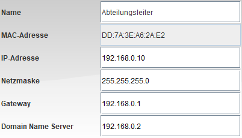
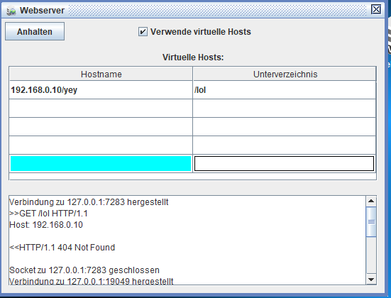

# 🖥 Filius Lernzettel

Die Lernsoftware **Filius** dient der Visualisierung von Netzwerken und dessen Konfiguration.

⚠ Zum **Netzwerk-Teil** geht es [hier](NETZWERKE.md)!

## Inhalt

1. 🎨 [Interface](#kap1)
2. 🎰 [Rechner](#kap2)
3. 🔌 [Switch](#kap3)
4. 🔩 [Router](#kap4)
5. 🔗 [Modem](#kap5)

## 🎨 Interface <a name="kap1"></a>

##### Simulation

- Es ist möglich, zwischen dem "🔨 Baumodus" und dem "▶ Simulationsmodus" zu wechseln.
  - Der "🔨 Baumodus" dient dem Platzieren von Geräten, wie auch dem konfigurieren der Netzwerkoptionen dieser Geräte.
  - Der "▶ Simulationsmodus" ermöglicht den Zugriff auf die Software der Geräte und startet die Geräte. Man zieht außerdem, wann wo Daten fließen.
- Die Prozentanzeige ermöglicht die Simulationsgeschwindigkeit zu regeln.

##### Aufbau

- Im Hauptfenster können die Geräte platziert werden, ein Doppelklick auf ein Gerät öffnet dessen Konfiguration.
- Der "✏ Bleistift" ermöglicht das Kommentieren und Strukturieren des Netzwerkes.

##### Konfiguration

- Für jedes Gerät öffnet sich am unteren Rand ein Fenster mit allen Einstellungsmöglichkeiten.

## 🎰 Rechner <a name="kap2"></a>

**Rechner**, bzw. auch **Notebooks** *(Die Funktionalität ist dieselbe.)* können folgende Eigenschaften haben:



| Option      | Beschreibung                                                 |
| ----------- | ------------------------------------------------------------ |
| Name        | Die Namen der Geräte werden im Hauptfenster angezeigt.<br />Sinnvoll, um klar den Zweck eines Gerätes zuordnen zu können. |
| MAC-Adresse | ***Kann nicht geändert werden!*** - Hardwaregebundene Adressen, um IP-Adressen (z.B. durch DHCP) zuordnen zu können. |
| IP-Adresse  | *Kann entweder manuell eingetragen werden oder per DHCP zugeordnet werden.*<br />⚠ **Wichtig:** Um ohne Gateway kommunizieren zu können, müssen die IP-Adressen im selben Subnetz liegen! (Siehe [Netzwerktechnik](NETZWERKE.md)) |
| Netzmaske   | *Wird im Falle eines DHCPs automatisch übermittelt.*<br />Gibt an, mit welchem Adressbereich das Gerät kommunizieren kann. (Siehe [Netzwerktechnik](NETZWERKE.md)) |
| Gateway     | *Wird im Falle eines DHCPs automatisch übermittelt.*<br />Gibt an, wohin Daten gesendet werden sollen, wenn der Empfänger nicht im selben (Sub-)Netz liegt. |
| DNS         | *Wird im Falle eines DHCPs automatisch übermittelt.*<br />Gibt an, wo die IP-Adressen zu Domains (z.B. "google.de") nachgeschaut werden sollen. |

### Software

Auf jedem PC / Notebook können folgende Programme installiert werden:
*(Ein paar sind ausgelassen, die nicht verwendet werden.)*

| Name             | Beschreibung                                                 |
| ---------------- | ------------------------------------------------------------ |
| **Befehlszeile** | Per Befehl können vor allem (z.B. durch *ping* oder *traceroute*) Verbindungen getestet werden. |
| Bildbetrachter   | Im Dateisystem hinterlegte Bilder können hiermit angezeigt werden. |
| Datei-Explorer   | Ermöglicht den *Zugriff auf das Dateisystem*. Es ist auch möglich, Dateien in Filius zu importieren. |
| **DNS-Server**   | Ergänzt die *DNS-Funktionalität* in einem Rechner. Die IP des Rechners muss dann als DNS-Server andererorts eingetragen werden. |
| Firewall         | Ermöglicht das Blockieren von Ports auf dem System.          |
| Text-Editor      | Ermöglicht das Editieren von Dateien im Dateisystem.         |
| **Webserver**    | Ergänzt *HTTP-Server-Funktionalität* im Rechner. Die im Ordner "webserver" hinterlegten Dateien werden über die IP-Adresse fürs Netzwerk zugänglich gemacht. |
| **Webbrowser**   | Aufrufen von *Html-Seiten* über das Netzwerk.                |

##### Webserver

Jeder Webserver muss über das Fenster gestartet werden. Dort können auch "Virtuelle Hosts" aktiviert werden.

Im **Dateisystem** sehen die Server so aus:

```
> webserver
  > index.html
  > splashscreen-mini.png
```

- Die *Index*-Datei wird grundsätzlich immer aufgerufen, wenn in der Adresszeile keine spezielle Datei angegeben ist. Ein Aufruf von `http://192.168.0.10/datei.html` öffnet `datei.html`. Wenn in der URL keine Datei angegeben ist ( `http://192.168.0.10/` ), wird immer automatisch die `index.html` Datei aufgerufen.
- Die `splashscreen-mini.png` Datei wird in der HTML Datei verwendet, auch das ist möglich.

Es können außerdem sogenannte **virtuelle Server** erstellt werden. Dazu muss in der Software einfach der Haken gesetzt werden. Dann können zusätzliche Websites konfiguriert werden:



In diesem Beispiel wird über den Link `http://192.168.0.10/yey` die Website `webserver/lol/index.html` aufgerufen. Oder wahlweise über `http://192.168.0.10/yey/web.html` die Seite `webserver/lol/web.html`. Das Dateisystem könnte mit virtuellen Server z.B. so aussehen:

```
> webserver
  > index.html
  > splashscreen-mini.png
  > doogle
    > index.html
    > suche.html
    > logo.png
  > github
    > index.html
    > awesome.html
```

##### DNS-Server


Auch DNS-Server müssen zunächst gestartet werden.

Jeder DNS-Server enthält eine Liste von Zuweisungen. Andere PCs können, wenn dort dieser DNS-Server als IP eingetragen wurde, die Domains zu IPs auflösen lassen.


Dies ist der Nameserver-Tab, denn es wäre unpraktisch alle Domains wieder und wieder in jeden DNS-Server eintragen zu müssen. Daher kann man hier auf andere DNS-Server verweisen, an die unbekannte Domainanfragen weitergeleitet werden sollen. Die Domain `.` steht für "Alle Anfragen", hier werden alle .de-Domains weitergeleitet. Der Nameserver `dns.de` muss bei den Adressen auch noch angegeben werden.

## 🔌 Switch <a name="kap3"></a>

Der sogenannte **Switch** in Filius ermöglicht das Verbinden von vielen Geräten an dieselbe Leitung. An einen Switch kann eine nicht begrenzte Anzahl an Geräten angeschlossen werden, jede Verbindung selbst (per Kabel) ist aber trotzdem Ende-zu-Ende. Der Switch verteilt die Daten dann jeweils an die richtigen MAC-Adressen weiter.

## 🔩 Router <a name="kap4"></a>

Ein **Router** hat eine feste Anzahl an Anschlüssen, zwischen denen er dann vermitteln kann. In Filius heißen Router *"Vermittlungsrechner"*. Ein Router vermittelt zwischen mehreren Netzwerken, jeder der vorher konfigurierten Anschlüsse muss daher in einem anderen (Sub-)Netz liegen.

##### Konfiguriation

- Es gibt einen Haupttab, in dem *Name*, *Gateway*, *Firewall* und *Anschlüsse* konfiguriert werden können.
  - Außerdem kann *Automatisches Routing* aktiviert werden, wenn es deaktiviert ist, tritt die *Weiterleitungstabelle* in Kraft. (Dazu unten mehr)
- Für jeden Anschluss können folgende Einstellungen gemacht werden:

| Name        | Wirkung                                                      |
| ----------- | ------------------------------------------------------------ |
| IP-Adresse  | Der Router ist in jedem Netz als Gerät verfügbar und kann von den dortigen Geräten als *Gateway* angegeben werden. Weil der Router als Gerät im Netz ist, braucht er für dieses Netz auch eine IP. |
| Netzmaske   | Die Netzmaske des Netzwerks, damit feststeht, welche Geräte im Netz erreichbar sind. |
| MAC-Adresse | *Kann nicht verändert werden.* - Ist nur wichtig, um z.B. Anfragen in Switches nachzuvollziehen. |

##### Weiterleitungstabelle

In dieser Tabelle können, wenn die Option *Automatisches Routing* deaktiviert ist, Weiterleitung über mehrere Netze hinweg eingestellt werden. Dies ist nützlich, wenn z.B. entferntere Netze sonst nicht angesteuert werden können, weil sie hinter mindestens einem weiteren Router liegen.

Es kann folgendes eingestellt werden:

| Ziel                                                         | Netzmaske               | Nächstes Gateway                                             | Über Schnittstelle                                         |
| ------------------------------------------------------------ | ----------------------- | ------------------------------------------------------------ | ---------------------------------------------------------- |
| IP-Adresse des Netzes (oder Gerätes), an das gesendet werden soll. | Subnetzmaske des Ziels. | Ein Router, an den die Daten weiter gesendet werden sollen, wenn sie zu dem "Ziel" sollen. | Die IP-Adresse des gewünschten Ausgangs am eigenen Router. |

***Tipp:*** *Nimm den Haken bei "Alle Einträge anzeigen" heraus, um nur die wichtigen Einträge in der Tabelle zu sehen.*

##### Firewall


In der Übersicht kann die Firewall aktiviert werden und es gibt folgende Einstellungen:

- "ICMP-Pakete filtern" => Ob z.B. Ping anfragen in der Firewall hängen bleiben sollen
- "nur SYN-Pakete verwerfen" => Öffnet automatisch den Rückkanal von erlaubten Anfragen.


Hier können IP und Subnetzmaske jeweils aus dem Quellnetz und Zielnetz eingetragen werden - Frei lassen zum Aktivieren von allen. Die Spalten sollten sich selbst erklären.

Oben kann die Standardaktion eingetragen werden, also was ohne Regel passieren soll.

Wichtig ist noch, dass Regeln höher in der Liste auch höhere Priorität haben.

## 🔗 Modem <a name="kap5"></a>

Ein **Modem** ist immer eine Brücke über das *reale Netzwerk* (Außerhalb von Filius) zu einer anderen Instanz zu Filius. Dazu muss im Modem folgendes angegeben werden:

| Option                | Beschreibung                                                 |
| --------------------- | ------------------------------------------------------------ |
| Name                  | Dient der Übersichtlichkeit.                                 |
| Auf Verbindung warten | Eins der beiden Modems muss diese Option aktivieren.<br />Dieses Modem wird zum "Host" und wartet auf die Verbindung. |
| IP-Adresse            | Die **reale** IP-Adresse des PCs, auf dem Filius mit dem anderen Modem läuft. |
| Port                  | Ein Port, auf den sich zwischen beiden Modems geeinigt wurde.<br />Dadurch können mehrere Modem-Verbindungen gleichzeitig bestehen. |

