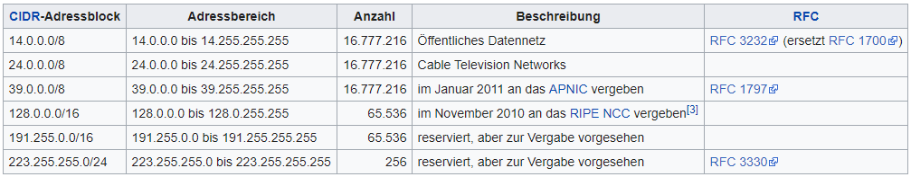
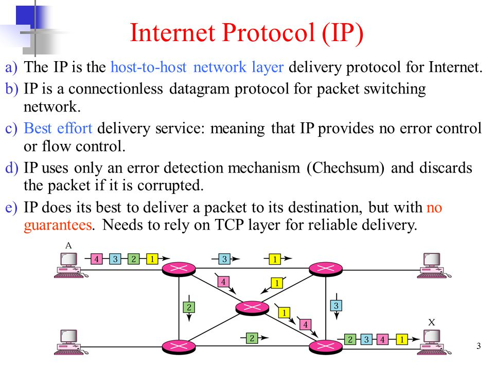
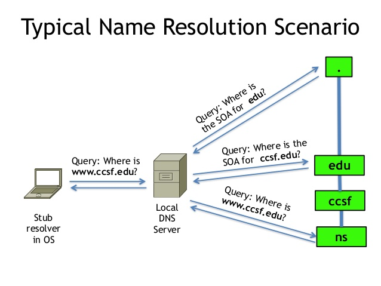
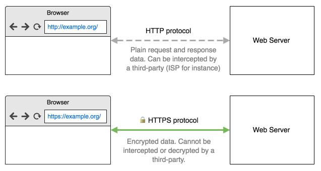

# 🔌 Netzwerktechnik Lernzettel

Dies ist der Lernzettel für die IT Klausur, basierend auf dem letzten Lernzettel für die Netzwerktechnik-Klausur! 

⚠ Zum **Filius-Teil** geht es [hier](FILIUS.md)!

## Inhalt

1. 🔢 [Wdhl. Zahlensysteme](#kap1) (Wird bald in den Steuerungstechnik-Lernzettel verschoben!)
2. 🏗 [Das OSI-Modell](#kap2)
3. 🗓 [IP-Adressen und Subnetze](#kap3)
4. 📑 [Protokolle](#kap4)

------

## 🔢 Zahlensysteme (Wdhl.) 

**Zahlen** werden heutzutage an jeder Ecke verwendet, wenn eine Menge oder ein Wert *fest definiert*
werden muss. Im Alltag verwenden wir normalerweise das **Dezimalsystem**, in dem genau **Zehn
verschiedene Zustände** pro Ziffer darstellt werden können. Das ist dahingehend praktisch, da der
Mensch selbst 10 Finger besitzt und so diese Werte leicht nachvollziehen kann. Anstatt von 0 bis 9 zu zählen, gibt es aber noch andere Möglichkeiten. *(Siehe Tabelle unten)*

**Binär und Hexadezimal** sind die populärsten anderen Zahlensysteme, allerdings kann man beliebig viele Zahlensysteme selbst erstellen, denn das Grundprinzip ist immer dasselbe. Jedes System zeichnet sich dadurch aus, wie viele Zustände sich in einer Stelle darstellen lassen. Dezimalzahlen (10er), Binär (2er) und Hexadezimal (16er). - So fängt man in einem 2er System schon bei der Zahl 3 an, eine zweite Ziffer vorne anzuhängen, im Dezimalsystem ab der Zahl 10 und im Hexadezimalsystem ab der 16.

| Dezimal | Binär | Hexadezimal |
| ------- | ----- | ----------- |
| 0       | 0     | 0           |
| 1       | 1     | 1           |
| 2       | 10    | 2           |
| 3       | 11    | 3           |
| 4       | 100   | 4           |
| 5       | 101   | 5           |
| 6       | 110   | 6           |
| 7       | 111   | 7           |
| 8       | 1000  | 8           |
| 9       | 1001  | 9           |
| 10      | 1010  | A           |
| 11      | 1011  | B           |
| 12      | 1100  | C           |
| 13      | 1101  | D           |
| 14      | 1110  | E           |
| 15      | 1111  | F           |

Welchen Wert hat nun die *Binärzahl 100*?
$$
Binär 100 => 1*2^2 + 0*2^1 + 0*2^0 => 1*4 + 0 + 0 => 4 Dezimal
$$

##### Tipp für die Klausur:

Umrechnungen kann man sich meist **sehr vereinfachen** und da wir am PC
schreiben, bietet sich die Verwendung des **Windows-Taschenrechners** an.
Dieser hat im Tab „Programmieren“ eine Umrechnungsfunktion eingebaut.

------

## 🏗 Das OSI-Modell 

Das *„Open Systems Interconnection Model“* ist ein **Referenzmodell**, das seit 1984 durch die ISO
(International Organization for Standardization) anerkannt wurde. Es stellt die **Netzwerkprotokolle
als unabhängige Ebenen** dar, die ineinander verkapselt dann genau so in der Praxis verwendet
werden. So sieht es aus:

| Ebene         | Orientierung | DoD-Schicht | Einordnung                          | Protokolle                | Geräte                    |
| ------------- | ------------ | ----------- | ----------------------------------- | ------------------------- | ------------------------- |
| 7 Anwendungen | Anwendung    | Anwendung   | Ende zu Ende                        | HTTP, DNS, DHCP, XMPP ... | Gateway, Proxy ...        |
| 6 Darstellung | Anwendung    | Anwendung   | Ende zu Ende                        | HTTP, DNS, DHCP, XMPP ... | Gateway, Proxy ...        |
| 5 Sitzung     | Anwendung    | Anwendung   | Ende zu Ende                        | HTTP, DNS, DHCP, XMPP ... | Gateway, Proxy ...        |
| 4 Transport   | Transport    | Transport   | Ende zu Ende                        | TCP, UDP ...              | Gateway, Proxy ...        |
| 3 Vermittlung | Transport    | Internet    | Ende zu Ende                        | ICMP, IP ...              | Router                    |
| 2 Sicherung   | Transport    | Netzzugriff | Direkte Verbindung (Punkt zu Punkt) | Ethernet, MAC             | Bridge, (Normaler) Switch |
| 1 Physisch    | Transport    | Netzzugriff | Direkte Verbindung (Punkt zu Punkt) | -                         | Kabel, Repeater, Hub      |

**Weitere Erläuterungen dazu:**

| Begriff            | Erklärung                                                    |
| ------------------ | ------------------------------------------------------------ |
| DoD                | Abgekürztes Schichtenmodell                                  |
| Ende zu Ende       | Paket kann über viele Rechner springen, hat aber einen Start und ein Ziel. |
| Direkte Verbindung | Beide Geräte müssen direkt miteinander verbunden sein.       |

**Was machen die einzelnen Ebenen?**

| Schicht             | Erklärung                                                    |
| ------------------- | ------------------------------------------------------------ |
| 7 **Anwendungen**   | Was-auch-immer-der-Nutzer-machen-möchte. z.B. Spiele oder Email-Clients |
| 6 **Darstellungen** | **Übersetzt und verschlüsselt** die Daten auf Anwendungsebene, damit der Nutzer sie lesen kann. |
| 5 **Sitzung**       | Erstellt und verwaltet Verbindungen auf *Anwendungsebene*. Es wird sichergestellt, dass eine **Verbindung zwischen Programmen** dauerhaft aufrecht erhalten wird. |
| 4 **Transport**     | Je nach Paketprotokoll sollen hier die **Pakete** erstellt und etikettiert werden. Dazu müssen Netzwerkdaten in Blöcke unterteilt werden und es wird ein **Port** zugeordnet. |
| 3 **Vermittlung**   | Diese Ebene sorgt dafür, dass "Pakete" also *etikettierte Datenblöcke* über viele Rechner hinweg reisen können. Dazu werden unter anderem **IP-Adressen** verwendet. Man nennt sie auch die "Netzwerk-Schicht". Die Pakete aus Schicht 4 werden mit einer IP-Adresse versehen und so versandfähig gemacht. |
| 2 **Sicherung**     | Soll die Verbindung absichern, indem 3.-Schicht Daten in "Frames" also **kleinere Blöcke** geteilt und durch "[Prüfsummen](https://www.it-talents.de/blog/it-talents/was-sind-pruefsummen-checksums)" **mathematisch abgesichert** werden. |
| 1 **Physisch**      | Kabelverbindungen oder "dumme" Geräte, denen die gesendeten Daten egal sind. |

------

## 🗓 IP-Adressen und Subnetze  

##### Aufbau

Jede IP-Adresse besteht aus *4 Zahlen*, die jeweils im Bereich von *0-255* liegen. Beispielsweise
`192.0.2.42`. Dies ist eine IPv4 Adresse, das heutzutage geläufigste Format, da die neuere Version 6
(also IPv6) des IP-Protokolls sich noch nicht durchsetzen konnte. IPv6 Adressen bestehen aus 8
Blöcken, die jeweils aus 4 Hexadezimalen Zahlen bestehen. Beispiel:
`2001:0db8:85a3:0000:0000:8a2e:0370:7344` So können statt 4.2 Milliarden Adressen in IPv4
665 Billiarden Adressen dargestellt werden.

Letztlich dient jede IP Adresse der eindeutigen Identifikation eines Gerätes über mehre Netzwerke
hinweg. Folgende Adressen sind reserviert:

Wichtig ist im Grund nur, dass Adressen, die mit 192.168 anfangen, innerhalb eines privaten Netzes
verwender werden.

##### Standardvergabe

In einem Netzwerk steht die erste Adresse immer für das Netzwerk selbst und die höchste Adresse
für den Broadcast. Wenn ein Gerät an diese IP sendet, wird es an alle Geräte gesendet. Beispiel:

Im Netzwerk 192.168.178.60 ist 192.168.178.**0** das Netzwerk und 192.168.178.**255** der Broadcast

Alle anderen IPs dazwischen können Geräten zugewiesen werden.

##### Subnetze

Um Netzwerke in kleinere Netze zu unterteilen, gibt es sogenannte Subnetze. Um das zu verstehen,
sollte man sich die *IP-Adressen auf Bitebene* ansehen:

|                  | Dezimal         | Binär                               |
| ---------------- | --------------- | ----------------------------------- |
| **IP-Adresse**   | 24.98.0.233     | 00011000.01100010.00000000.11101001 |
| **Subnetzmaske** | 255.255.255.192 | 11111111.11111111.11111111.11000000 |

Die Subnetzmaske definiert von links nach rechts, welche Bits zum Netz gehören und welche zum
Host. Der Netzanteil besteht aus den 1en, dieser ist innerhalb eines Netzwerkes festgelegt. Der
Hostanteil variiert von Gerät zu Gerät, angezeigt durch die 0en.

In einem Netzwerk mit einer Subnetzmaske, die nur aus 0en und 255en besteht, ist das dann sehr
einfach. Beispielsweise ein Netzwerk mit der IP 192.168.178.0 und der Subnetzmaske 255.255.255.0
könnte dann alle IPs von 192.168.178.0 - 192.168.178.255 enthalten.

Jedoch lassen sich die IP-Blöcke wie im Beispiel oben auch noch weiter unterteilen. Dort sind die
ersten zwei Bits der letzten Zahl „markiert“ und gehören zum Netz. Das unterteilt die 256 möglichen
Adressen in 4 weitere Subnetze. Wieso? Man zählt die 11en im Block von links und rechnet den Wert
genauso aus, wie man es sonst tun würde. Nur von links. Das heißt:

192 => 1100 0000 => 2
0 + 2
1 = 3. Bedenke, dass 0 auch noch ein darstellbarer Wert ist, das heißt es
sind 4 Werte darstellbar. Deshalb gibt es in diesem Netz 4 Subnetze. Jedes Subnetz erhält daher
einen Bereich von 256/4 = 64 Adressen. Also sehen die Bereiche so aus:

| Nr   | Adressbereich                       |
| ---- | ----------------------------------- |
| 0    | 24.98.0.**0** bis 24.98.0.**63**    |
| 1    | 24.98.0.**64** bis 24.98.0.**127**  |
| 2    | 24.98.0.**128** bis 24.98.0.**191** |
| 3    | 24.98.0.**192** bis 24.98.0.**255** |

Das geht auch über mehrere Blöcke hinweg:

|                  | Dezimal       | Binär                               |
| ---------------- | ------------- | ----------------------------------- |
| **IP-Adresse**   | 172.57.66.200 | 10101100.00111001.01000010.11001000 |
| **Subnetzmaske** | 255.255.240.0 | 11111111.11111111.11110000.00000000 |

Dieses Mal sind 16 Subnetze eingeteilt, jeweils mit 16x256 also 4096 Adressen. Beispielsweise das
erste Netz verläuft dann von 172.57.**0**.0 bis 172.57.**15**.255

##### Netzklassen

Diese Subnetzmasken werden in grobe Klassen unterteilt: Klasse A, B und C.

| Klasse A            | Klasse B          | Klasse C            |
| ------------------- | ----------------- | ------------------- |
| Maske 255.0.0.0     | Maske 255.255.0.0 | Maske 255.255.255.0 |
| 16.777.216 Adressen | 65.536 Adressen   | 256 Adressen        |

Bedenke, dass zum Beispiel 255.192.0.0 z.B. noch als Klasse A gelten würde, das dann nur weiter
eingeteilt wurde. 255.255.128.0 würde zu Klasse B gehören etc.

------

## 📑 Protokolle 

Um in einem Netzwerk kommunizieren zu können, gibt es mehrere **Netzwerkprotokolle**, die das Format bestimmen, also *wie* die Daten übermittelt werden.

Eine Übersicht aller wichtigen Protokolle des OSI-Modells gibt es hier:

| Name  | OSI-Schicht     | Zweck                                                | Schaubild / Erklärung                                        |
| ----- | --------------- | ---------------------------------------------------- | ------------------------------------------------------------ |
| IP    | 3 - Vermittlung | Etikettierung von Paketen                            |                        |
| ICMP  | 3 - Vermittlung | Grundfunktionen                                      | Ermöglicht u.a. Befehle wie *Ping und Traceroute*            |
| TCP   | 4 - Transport   | Zuverlässiger Datenaustausch                         | Datenpakete werden vom Empfänger bestätigt, bevor die nächsten Daten gesendet werden. (Wird z.B. für Web genutzt) |
| UDP   | 4 - Transport   | Schneller Datenaustausch                             | Datenpakete werden "drauf los" zum Empfänger gesendet, ob die Verbindung noch besteht muss zusätzlich geprüft werden (z.B. in Spielen) |
| DHCP  | 5-7             | Vergabe von IPs                                      |                      |
| DNS   | 5-7             | Auflösen von Domains, z.B. von "google.de"           |                       |
| HTTP  | 5-7             | Übertragen von Websites                              |                      |
| HTTPS | 5-7             | Sicheres und Verschlüsseltes übertragen von Websites |                     |
| FTP   | 5-7             | Übertragen von Dateien                               | Wird u.a. verwendet um auf das Dateisystem eines Servers zuzugreifen. z.B. wenn man bei Nitrado einen Gameserver mietet. |

